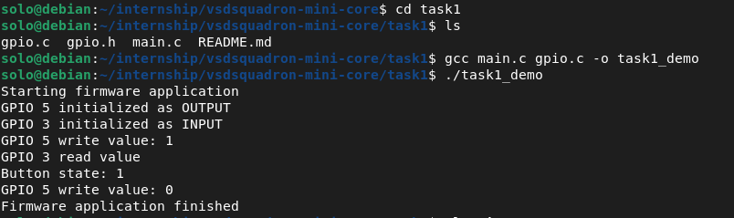

# Task 1: Firmware Foundations & Environment Setup

---

### 1) What is a firmware library?

A firmware library is a collection of pre-written C functions that acts as a bridge between our application code and the raw hardware. Instead of directly writing to memory addresses and hardware registers, the library gives us clean, simple functions to call. It handles all the low-level complexity in the background so we can focus on what we actually want the hardware to do.

**Figure 1: Firmware Abstraction Stack**
```
┌─────────────────────────────────┐
│   main.c  (Application Code)    │
│   gpio_write(PIN_13, HIGH);     │
└──────────────┬──────────────────┘
               │  calls API
┌──────────────▼──────────────────┐
│   gpio.c  (Firmware Library)    │
│   Implements function logic     │
└──────────────┬──────────────────┘
               │  writes to register
┌──────────────▼──────────────────┐
│   RISC-V Hardware Registers     │
└─────────────────────────────────┘
```

---

### 2) Why are APIs important in embedded systems?

APIs bring structure and abstraction to embedded development. Instead of hardcoding messy register addresses everywhere, we get readable functions like `gpio_write()` or `delay_ms()`. They also make code portable — if we switch to a different microcontroller, only the library implementation changes. The application code in `main.c` stays exactly the same. This separation makes code easier to test, maintain, and share across teams.

**Figure 2: API Portability Across Hardware**
```
┌──────────────────────────────┐
│  Application Logic (main.c)  │
└──────────────┬───────────────┘
               │
┌──────────────▼───────────────┐
│   Firmware API               │
│   gpio_write(), delay_ms()   │
└───┬──────────┬───────────┬───┘
    │          │           │
┌───▼────┐ ┌──▼──────┐ ┌──▼──────┐
│RISC-V  │ │ARM      │ │AVR /    │
│SoC     │ │Cortex-M │ │Arduino  │
└────────┘ └─────────┘ └─────────┘
  swap         swap        swap
 library      library     library
```

---

### 3) What was understood from the lab code?

The lab showed a clear separation of concerns across three files:

- **`gpio.h`** — defines the API (function declarations only). The application only needs this to use the library.
- **`gpio.c`** — contains the actual implementation. Right now it uses `printf` to simulate hardware behavior. When the real RISC-V board arrives, only this file needs to change — the `printf` calls get replaced with actual register writes.
- **`main.c`** — the application layer. It calls `gpio_init()`, `gpio_write()`, and `gpio_read()` without knowing anything about how they work internally.

This is exactly how real embedded firmware is structured. The library creates a clean boundary between hardware complexity and application logic.

---

### Lab Execution Screenshots

Screenshot of the terminal showing compilation and program output:



---

*Submitted by: Sarthak Garg | GitHub: solo8116*