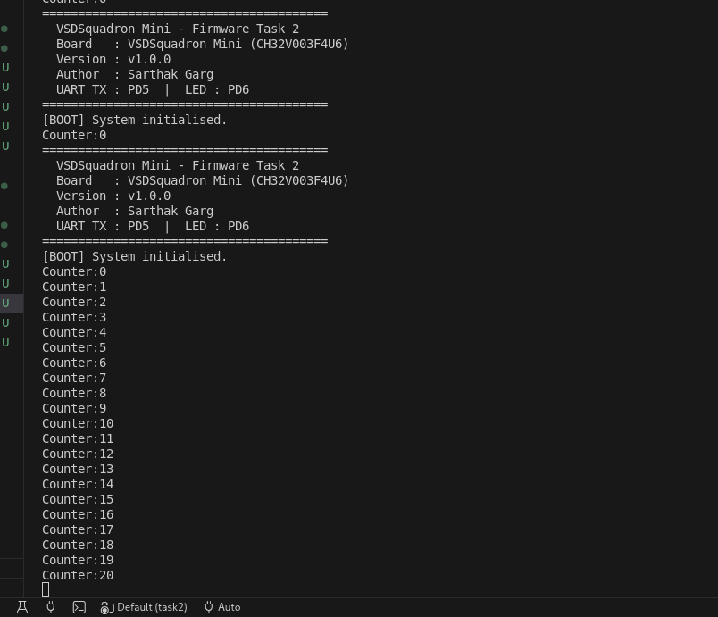
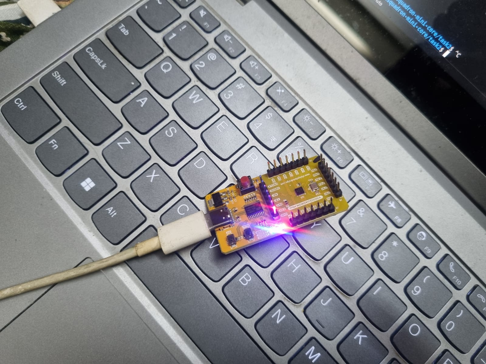

# Task 2 — Evidence Document
**VSDSquadron Mini RISC-V Embedded Firmware Internship**
Author: Sarthak Garg

---

## 1. UART Evidence

### Serial Terminal Screenshot

### Serial Terminal Video

<video src="output.mp4" controls width="30%"></video>

---

## 2. GPIO Evidence

### Physical Pin Identification

| Field | Value |
|---|---|
| Physical pin label (silkscreen on board) | **PD6** |
| Port | GPIOD |
| Firmware GPIO number | **6** |
| DataSheet reference | Table 3 — "Built-in LED Pin: 1x onboard user LED (PD6)" |
| Mode configured | GPIO_OUTPUT (push-pull, 50MHz) |
| Toggle period | 500ms |

### Photo — Board with LED Blinking

### Video — LED Blink

<video src="board.mp4" controls width="30%"></video>

---

## 3. Verification Explanation

### How correct UART behaviour was verified

1. Flashed firmware via `pio run --target upload`.
2. Opened serial monitor at **115200 baud, 8N1** using `pio device monitor`.
3. On reset, the startup banner appeared immediately — confirming UART initialisation runs before the main loop.

   

4. Counter lines began printing every 500ms and continued indefinitely.
5. The millis timestamp was cross-checked: line N appears at approximately N × 500ms after boot, confirming the SysTick timer is correct at 24MHz.

### How correct GPIO behaviour was verified

1. The LED on PD6 was observed to toggle every 500ms in sync with the UART counter.
2. `Counter: N  LED: ON` lines correspond to odd N (LED physically lit).
3. `Counter: N  LED: OFF` lines correspond to even N (LED physically off).
4. The LED state printed over UART exactly matched the physical LED state, confirming that `gpio_toggle()` and the UART status message are in sync.
5. No direct register writes appear in `main.c` — verified by code review. All pin control goes through `gpio_init()` and `gpio_toggle()` from `gpio.h`.

### Pin mapping verification

- PD6 used in firmware as pin number `6`, port `GPIOD`.
- DataSheet Table 3 confirms: *"Built-in LED Pin: 1x onboard user LED (PD6)"*.
- The silkscreen on the board labels the pin "PD6".
- Numbers match exactly — no invented numbering.